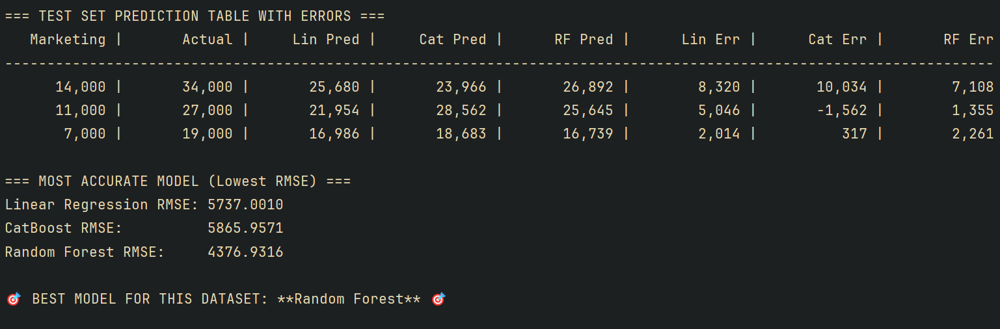
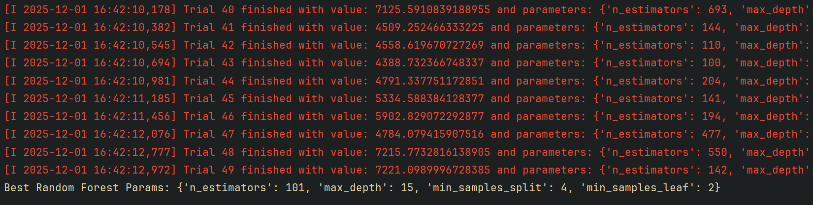

# 🔥 ML Model Comparison with Optuna Hyperparameter Tuning by Lance Jepsen


This project performs a full machine learning comparison between **Linear Regression**,  
**CatBoost (Optuna-tuned)**, and **Random Forest (Optuna-tuned)** on a marketing dataset.

It automatically:
- Splits training/testing data
- Runs **Optuna (50 trials)** hyperparameter tuning
- Calculates **RMSE** (official accuracy metric)
- Chooses the **best model**
- Generates comparison tables
- Plots all model predictions
- The included tiny dataset is marketing spend versus sales
  
---

# 📊 Screenshots

### *Model Comparison and Prediction Table*


### **Optuna Tuning Results**


---

# 🚀 Features

### ✔ Linear Regression  
Baseline performance with no hyperparameters.

### ✔ Tuned CatBoost  
- Iterations: optimized  
- Depth: optimized  
- Learning Rate: optimized  
- RMSE-focused tuning  

### ✔ Tuned Random Forest  
- Tree count: optimized  
- Depth: optimized  
- Sample splits/leaves optimized  

### ✔ Optuna Tuning  
Smart Bayesian optimization exploring hyperparameters for the best RMSE.

---

# 🧠 Why RMSE?
RMSE penalizes large errors strongly and is the standard for regression model accuracy.

The project automatically selects:

> 🎯 **Best Model = Model with the Lowest RMSE**

---

# 📦 Installation

```
pip install -r requirements.txt
```

---

# ▶️ Run the Pipeline

```
python model_tester.py
```

---

# 📁 Project Structure

```
project/
│
├── model_tester.py
├── README.md
├── requirements.txt
├── LICENSE
├── screenshots/
    ├── table.png
    └── optuna.png
```

---

# 📝 License
This project is licensed under the **MIT License**.

---

# 🤖 Author
Lance Jepsen, generated with assistance from **ChatGPT (OpenAI)**.
